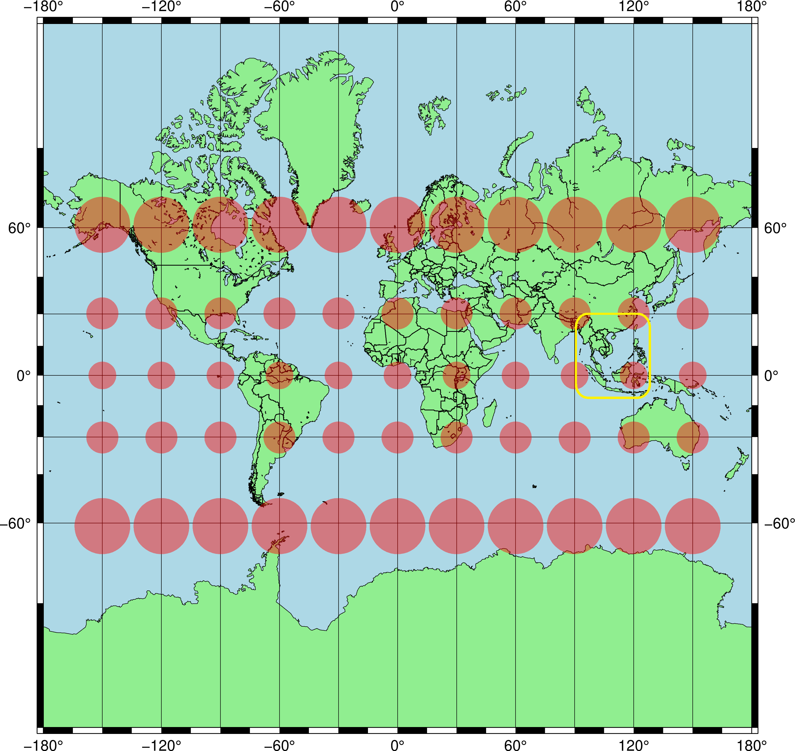

# แบบฝึกหัดที่ 6: Map Distortion and Tissot Indicatrix

## วัตถุประสงค์

ให้นิสิตศึกษาความบิดเบี้ยวของแผนที่ (**Map Distortion**) สำหรับกรณีการฉายแผนที่แบบ Mercator โดยพิจารณาจากรูปร่างของ **Tissot Indicatrix** บนแผนที่ที่สร้างด้วยภาษา Python และไลบรารี **Cartopy**

ตัวอย่างรูปแบบการแสดงผลสามารถดูได้จากภาพ:

<p align="center">  </p>

---

## งานที่มอบหมาย

ให้นิสิตเขียนโปรแกรมด้วย **Python + Cartopy** เพื่อวาดแผนที่โดยแสดง

* ขอบเขตแผ่นดิน
* เส้นชายฝั่ง
* รูปร่าง **Tissot Indicatrix**
* ประเทศไทย โดยเน้นพื้นที่ประเทศไทยเป็น **สีแดง**

ให้จัดทำภาพสำหรับใช้เป็นต้นแบบในการวาดด้วยมือจำนวน **2 ภาพ** ดังนี้

### หน้า A4 ที่ 1 — World Map

วาดแผนที่ให้ครอบคลุม **โลกทั้งใบ (World Map)**

โดยต้องแสดง

* ขอบเขตแผ่นดินและเส้นชายฝั่ง
* Tissot Indicatrix กระจายครอบคลุมพื้นที่โลก
* เน้นประเทศไทยด้วย **สีแดง**

### หน้า A4 ที่ 2 — Southeast Asia

วาดแผนที่ขยายบริเวณ **เอเชียตะวันออกเฉียงใต้ (Southeast Asia)**

โดยต้องแสดง

* ขอบเขตแผ่นดินและเส้นชายฝั่ง
* Tissot Indicatrix
* เน้นประเทศไทยด้วย **สีแดง**

---

## วิธีการจัดทำแบบฝึกหัด

ให้นิสิตแสดงภาพที่สร้างจากโปรแกรมบนหน้าจอคอมพิวเตอร์ แล้ว **คัดลอกภาพจากหน้าจอลงบนกระดาษ A4 ด้วยมือ**

สามารถใช้

* ดินสอ
* ปากกา
* อุปกรณ์เขียนแบบตามความเหมาะสม

**สำหรับเส้นตรงต่าง ๆ ให้ใช้ไม้บรรทัดเท่านั้น**

ให้ปรับสัดส่วนของภาพโดยการ **Zoom In / Zoom Out บนหน้าจอ** จนได้ขนาดที่เหมาะสมสำหรับการคัดลอกลงบนกระดาษ A4 จำนวน 1 หน้าต่อภาพ

ไม่จำเป็นต้องรักษามาตราส่วนของภาพจากหน้าจอโดยตรง แต่ควรรักษา **รูปร่าง ตำแหน่ง และสัดส่วนโดยรวม** ขององค์ประกอบบนแผนที่ให้ใกล้เคียงต้นฉบับ

---

## รูปแบบกระดาษ

งานทั้งสองหน้าต้องใช้ **Template กระดาษ A4 ที่เตรียมไว้ให้เท่านั้น**

ห้ามออกแบบหัวกระดาษใหม่หรือใช้ Template รูปแบบอื่น

สรุปงานที่ต้องส่ง:

**หน้า 1:** World Map + Tissot Indicatrix + Highlight Thailand
**หน้า 2:** Southeast Asia + Tissot Indicatrix + Highlight Thailand

---

## Software

แนะนำให้ใช้

```text
Python
Cartopy
Matplotlib
```

เพื่อสร้างภาพต้นแบบสำหรับการคัดลอกลงกระดาษ

