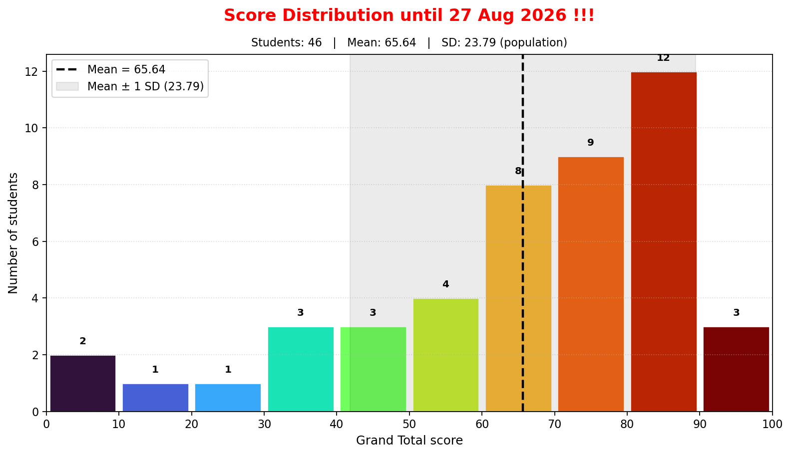

# Class Performance Summary

Exercise: 70% · Attendance: 30% · Exercise maximum: 78 · Attendance sessions: 4

**Grand Total statistics:** Students = 46 · Mean = 65.64 · SD = 23.79 (population)

## Score Distribution until 27 Aug 2026 !!!

| No. | Student ID | Name | Exercise | Exercise 70% | Attendance | Attendance 30% | Grand Total | Performance |
|---:|:---:|:---|---:|---:|:---:|---:|---:|:---:|
| 1 | 6610553157 | ---- | 18.00/78.00 | 16.15 | 2/4 | 15.00 | **31.15** | ★☆☆☆☆ |
| 2 | 6610553165 | ---- | 17.00/78.00 | 15.26 | 2/4 | 15.00 | **30.26** | ★☆☆☆☆ |
| 3 | 6610553173 | ---- | 20.00/78.00 | 17.95 | 1/4 | 7.50 | **25.45** | ★☆☆☆☆ |
| 4 | 6610553181 | ---- | 44.00/78.00 | 39.49 | 4/4 | 30.00 | **69.49** | ★★☆☆☆ |
| 5 | 6610553203 | ---- | 26.00/78.00 | 23.33 | 4/4 | 30.00 | **53.33** | ★☆☆☆☆ |
| 6 | 6610553220 | ---- | 0.00/78.00 | 0.00 | 2/4 | 15.00 | **15.00** | ★☆☆☆☆ |
| 7 | 6610553238 | ---- | 19.00/78.00 | 17.05 | 3/4 | 22.50 | **39.55** | ★☆☆☆☆ |
| 8 | 6610553254 | ---- | 46.00/78.00 | 41.28 | 4/4 | 30.00 | **71.28** | ★★★☆☆ |
| 9 | 6610553262 | ---- | 36.00/78.00 | 32.31 | 4/4 | 30.00 | **62.31** | ★★☆☆☆ |
| 10 | 6610553271 | ---- | 47.00/78.00 | 42.18 | 4/4 | 30.00 | **72.18** | ★★★☆☆ |
| 11 | 6610553289 | ---- | 21.00/78.00 | 18.85 | 3/4 | 22.50 | **41.35** | ★☆☆☆☆ |
| 12 | 6610553327 | ---- | 0.00/78.00 | 0.00 | 1/4 | 7.50 | **7.50** | ★☆☆☆☆ |
| 13 | 6610554153 | ---- | 45.00/78.00 | 40.38 | 2/4 | 15.00 | **55.38** | ★☆☆☆☆ |
| 14 | 6610554161 | ---- | 28.00/78.00 | 25.13 | 2/4 | 15.00 | **40.13** | ★☆☆☆☆ |
| 15 | 6710552942 | ---- | 46.00/78.00 | 41.28 | 4/4 | 30.00 | **71.28** | ★★★☆☆ |
| 16 | 6710552951 | ---- | 61.00/78.00 | 54.74 | 4/4 | 30.00 | **84.74** | ★★★★☆ |
| 17 | 6710552969 | ---- | 60.00/78.00 | 53.85 | 4/4 | 30.00 | **83.85** | ★★★★☆ |
| 18 | 6710552977 | ---- | 44.00/78.00 | 39.49 | 4/4 | 30.00 | **69.49** | ★★☆☆☆ |
| 19 | 6710552985 | ---- | 48.00/78.00 | 43.08 | 4/4 | 30.00 | **73.08** | ★★★☆☆ |
| 20 | 6710552993 | ---- | 33.00/78.00 | 29.62 | 3/4 | 22.50 | **52.12** | ★☆☆☆☆ |
| 21 | 6710553001 | ---- | 26.00/78.00 | 23.33 | 3/4 | 22.50 | **45.83** | ★☆☆☆☆ |
| 22 | 6710553027 | ---- | 53.00/78.00 | 47.56 | 4/4 | 30.00 | **77.56** | ★★★☆☆ |
| 23 | 6710553035 | ---- | 63.00/78.00 | 56.54 | 4/4 | 30.00 | **86.54** | ★★★★☆ |
| 24 | 6710553051 | ---- | 0.00/78.00 | 0.00 | 0/4 | 0.00 | **0.00** | ★☆☆☆☆ |
| 25 | 6710553078 | ---- | 65.00/78.00 | 58.33 | 4/4 | 30.00 | **88.33** | ★★★★☆ |
| 26 | 6710553086 | ---- | 38.00/78.00 | 34.10 | 3/4 | 22.50 | **56.60** | ★☆☆☆☆ |
| 27 | 6710553094 | ---- | 61.00/78.00 | 54.74 | 4/4 | 30.00 | **84.74** | ★★★★☆ |
| 28 | 6710553108 | ---- | 65.00/78.00 | 58.33 | 4/4 | 30.00 | **88.33** | ★★★★☆ |
| 29 | 6710553124 | ---- | 54.00/78.00 | 48.46 | 4/4 | 30.00 | **78.46** | ★★★☆☆ |
| 30 | 6710553141 | ---- | 65.00/78.00 | 58.33 | 4/4 | 30.00 | **88.33** | ★★★★☆ |
| 31 | 6710553167 | ---- | 46.00/78.00 | 41.28 | 3/4 | 22.50 | **63.78** | ★★☆☆☆ |
| 32 | 6710553191 | ---- | 74.00/78.00 | 66.41 | 4/4 | 30.00 | **96.41** | ★★★★★ |
| 33 | 6710553205 | ---- | 64.00/78.00 | 57.44 | 4/4 | 30.00 | **87.44** | ★★★★☆ |
| 34 | 6710553213 | ---- | 55.00/78.00 | 49.36 | 4/4 | 30.00 | **79.36** | ★★★☆☆ |
| 35 | 6710553264 | ---- | 38.00/78.00 | 34.10 | 4/4 | 30.00 | **64.10** | ★★☆☆☆ |
| 36 | 6710553272 | ---- | 42.00/78.00 | 37.69 | 4/4 | 30.00 | **67.69** | ★★☆☆☆ |
| 37 | 6710553281 | ---- | 41.00/78.00 | 36.79 | 4/4 | 30.00 | **66.79** | ★★☆☆☆ |
| 38 | 6710553299 | ---- | 65.00/78.00 | 58.33 | 4/4 | 30.00 | **88.33** | ★★★★☆ |
| 39 | 6710553329 | ---- | 46.00/78.00 | 41.28 | 4/4 | 30.00 | **71.28** | ★★★☆☆ |
| 40 | 6710553337 | ---- | 60.00/78.00 | 53.85 | 4/4 | 30.00 | **83.85** | ★★★★☆ |
| 41 | 6710553345 | ---- | 51.00/78.00 | 45.77 | 4/4 | 30.00 | **75.77** | ★★★☆☆ |
| 42 | 6710553353 | ---- | 71.00/78.00 | 63.72 | 4/4 | 30.00 | **93.72** | ★★★★★ |
| 43 | 6710553361 | ---- | 66.00/78.00 | 59.23 | 4/4 | 30.00 | **89.23** | ★★★★☆ |
| 44 | 6710553370 | ---- | 38.00/78.00 | 34.10 | 4/4 | 30.00 | **64.10** | ★★☆☆☆ |
| 45 | 6710553388 | ---- | 72.00/78.00 | 64.62 | 4/4 | 30.00 | **94.62** | ★★★★★ |
| 46 | 6710553396 | ---- | 66.00/78.00 | 59.23 | 4/4 | 30.00 | **89.23** | ★★★★☆ |

Performance rating: ★★★★★ ≥ 90, ★★★★☆ ≥ 80, ★★★☆☆ ≥ 70, ★★☆☆☆ ≥ 60, ★☆☆☆☆ &lt; 60.
